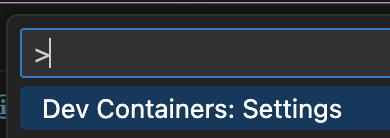
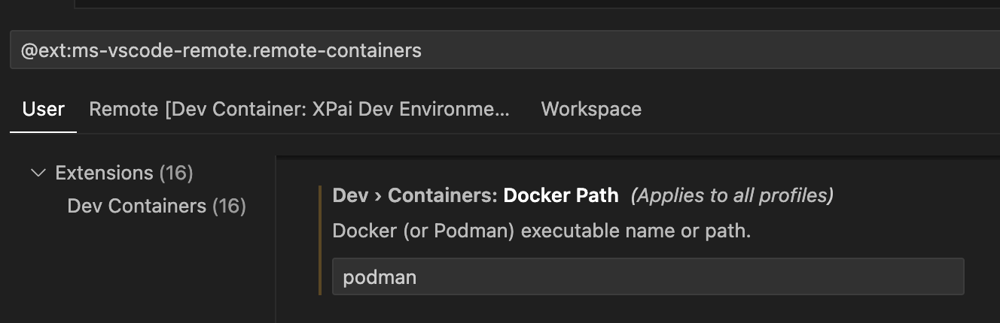

# AI Assistant Container Project Starter Repository

**NOTE: This repository is automatically synchronized from the [`ai-assistant-container-starter-repo/` directory of the main XPai](https://github.com/rise8-us/XPai/tree/main/ai-assistant-container-starter-repo) repository using Git subtree push.**

## Important Notes

- **This repository is READ-ONLY**
- All changes should be made in the XPai `ai-assistant-container-starter-repo/` directory
- This repo is automatically updated when changes are pushed from the source

## Prerequisites
- Podman (latest version recommended)
- Or you can use GitHub codespaces

## Overview

This starter repository provides everything you need to quickly set up an AI assistant development environment using containers.

For more details about the AI assistant base container itself, check out https://github.com/rise8-us/XPai/tree/main/ai-assistant-container.

For details about using a customized project container for project specific tools, see [that readme](project-container/README.md).

## GitHub Workflows

This starter includes automated CI/CD workflows for building, testing, and securing your project container:

- **Build & Publish** - Automatically builds and publishes container images when changes are pushed
- **Security Scanning** - Daily vulnerability scans with Trivy
- **Base Container Updates** - Monitors and updates AI assistant base container references

📖 **[Workflow Setup Guide](.github/workflows/README.md)** - Complete setup instructions and configuration options

## Setup

This starter supports two configurations based on your data requirements:

### **No CUI Data**
Your project does not give the container access to CUI data.

**→ Use Anthropic API (simpler setup, works in Codespaces)**

#### **📖 [No CUI Setup Guide](docs/SETUP-NO-CUI.md)**
- Simple Anthropic API setup
- Works with GitHub Codespaces
- Quick configuration

Refer to the detailed setup guides above for complete instructions.

### **CUI Data**
Your project gives the container access to CUI data.

NOTE: The use of the AI assistant container for CUI data is still a work in
progress and should not be used on a customer project.

**→ Use AWS Bedrock (required for CUI)**

   - [Haiku and Claude 3.5](https://aws.amazon.com/blogs/publicsector/accelerating-government-innovation-amazon-bedrock-models-get-fedramp-high-and-dod-il-4-5-approval-in-aws-govcloud-us/)
   - [Claude 3.7](https://aws.amazon.com/about-aws/whats-new/2025/07/anthropics-claude-3-7-sonnet-available-amazon-bedrock-aws-govcloud-us-west/)

#### **📖 [CUI Setup Guide](docs/SETUP-CUI.md)**
- AWS Bedrock with FedRAMP and IL4/5 compliance
- Local development only
- Enhanced security requirements
- Required firewall protection for network isolation (CMMC Level 2)

## Development Environment

After completing the setup guide, you can start your development environment using:
- **VSCode DevContainers** (recommended)
- **DevContainer CLI**
- **GitHub Codespaces** (no CUI projects only)

Before starting the container with either Option A or B, you must be logged into `ghcr.io`.
```bash
gh auth login -s read:packages
gh auth token | podman login ghcr.io -u $(gh api user --jq .login) --password-stdin
```

See "Troubleshooting" below if you have issues with the above.

### Option A: VSCode DevContainer (Recommended)

1. Make sure you have the [Dev Containers extension](https://marketplace.visualstudio.com/items?itemName=ms-vscode-remote.remote-containers) installed
2. Also make sure that you have the proper container runtime configured.


2. Open the project folder in VSCode
3. VSCode will prompt to "Reopen in Container" - click this button
4. Wait for the container to initialize

### Option B: DevContainer CLI

**Prerequisite**: Ensure `docker` binary is symlinked to `podman` (e.g., `ln -s /opt/homebrew/bin/podman ~/.local/bin/docker`)

```bash
# Install DevContainer CLI
npm install -g @devcontainers/cli

# Build and start container
devcontainer up --workspace-folder .

# Open shell in container
devcontainer exec --workspace-folder . bash
```

### Option C: GitHub Codespaces

1. **Configure environment variables** in GitHub:
   - Go to GitHub User Profile > Settings > Codespaces > Codespace user secrets
   - Add `ANTHROPIC_API_KEY` and grant access to your repositories

2. **Launch Codespace:**
   - Go to your repository on GitHub
   - Click "Code" button > Codespaces tab > "+"

3. **Note:** The `.devcontainer/devcontainer.json` file is configured to work with Codespaces automatically.

## Getting started with the dev-commands flow

1. Type `claude` in a terminal window.

2. Type `/dev-commands:help`.

3. Follow the online instructions.

## Multi-Project Support

This starter template supports running multiple projects simultaneously with isolated containers.

**Setup:**
1. Each project gets its own copy of this starter repository
2. Set `PROJECT_NAME` in `.env` to match your project directory name
3. Containers are named with your project prefix (e.g., `my-project-firewall-manager`)

**Benefits:**
- Work on multiple projects at the same time
- No container name conflicts
- Each project has isolated network namespace (CUI projects)
- Independent credentials and configuration per project

See setup guides for configuration details.

## Troubleshooting

For project-specific troubleshooting:
- **No CUI Projects**: See [No CUI Setup Guide](docs/SETUP-NO-CUI.md)
- **CUI Projects**: See [CUI Setup Guide](docs/SETUP-CUI.md)

### Authentication to pull containers

If your project team encounters authentication issues with `ghcr.io`, follow these steps on your host machine:

1. Log into GitHub CLI with package read permissions:
   ```bash
   gh auth logout
   gh auth login -s read:packages
   ```

2. Use your GitHub CLI token to authenticate with the container registry:
   ```bash
   podman logout ghcr.io
   gh auth token | podman login ghcr.io -u $(gh api user --jq .login) --password-stdin
   ```

3. Test pulling the image:
  ```bash
  podman pull ghcr.io/rise8-us/xpai/ai-assistant-home@sha:<digest>
  ```

### File permission issues in devcontainer

If you experience file permission problems inside the devcontainer (e.g., unable to create files/folders, files owned by 'root' or 'dialout' instead of 'aiAssistant', "Permission denied" errors), this is typically caused by running podman in rootful mode instead of rootless mode.

**Diagnosis:**

Check if your podman machine is running in rootless mode:
```bash
podman info --format '{{.Host.Security.Rootless}}'
```

This should return `true`. If it returns `false`, you are running in rootful mode.

**Solution:**

Rootless mode is the default for podman. If your machine is running in rootful mode, the recommended approach is to delete the podman machine and recreate it:

```bash
# Stop and delete the current machine
podman machine stop
podman machine rm

# Create and start a new machine (will default to rootless)
podman machine init
podman machine start
```

After recreating the machine, rebuild your devcontainer in VSCode.

**Note:** In some cases, even with rootless mode, files may still be owned by 'root'. If this occurs after recreating your podman machine, you can add the following to your `.devcontainer/devcontainer.json` `runArgs`:

```json
"runArgs": [
  "--userns=keep-id:uid=1001,gid=1001"
]
```

Then rebuild the devcontainer.

## Example advanced uses

- [XPai](https://github.com/rise8-us/XPai/tree/main)

## Assistance

If you run into issues, please hit us up in the #r-and-d Slack channel.
