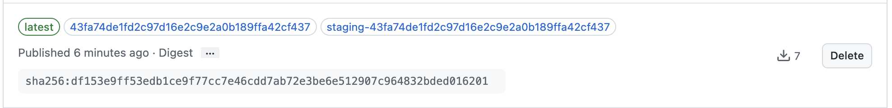

# AI Assistant Conatiner Project Starter Repository

**NOTE: This repository is automatically synchronized from the [`ai-assistant-container-starter-repo/` directory of the main XPai](https://github.com/rise8-us/XPai/tree/main/ai-assistant-container-starter-repo) repository using Git subtree push.**

## Important Notes

- **This repository is READ-ONLY**
- All changes should be made in the XPai `ai-assistant-container-starter-repo/` directory
- This repo is automatically updated when changes are pushed from the source

## Prerequisites
- Podman (latest version recommended)

## Overview

This starter repository provides everything you need to quickly set up an AI assistant development environment using containers. Below is an explanation of each file and directory:

| File/Directory | Purpose |
|----------------|---------|
| `.devcontainer/devcontainer.json` | VSCode Dev Containers configuration that defines the container image, environment variables, and post-creation commands for the development environment |
| `.env.example` | Template environment file containing required API key variables (GEMINI_API_KEY, ANTHROPIC_API_KEY) that users should copy to `.env` |
| `.gitignore` | Git ignore rules to prevent committing sensitive files like `.env` to version control |
| `.mcp.json` | Model Context Protocol (MCP) server configuration that registers the dev-commands MCP server for enhanced AI assistant capabilities |
| `CLAUDE.md.example` | Example Claude Code instruction file that defines development principles, TDD workflow, and coding standards for AI assistant interactions |
| `DEVELOPMENT.md` | Documentation explaining the synchronization process from the main XPai repository and how to make changes to this starter repository |
| `README.md` | This file - provides setup instructions, troubleshooting guides, and usage information for the AI assistant container environment |

## Container versions

To find the digest of the latest container:
1. Visit https://github.com/rise8-us/XPai/pkgs/container/xpai%2Fai-assistant-home/versions?filters%5Bversion_type%5D=tagged.
2. Copy the digest text. 
3. Replace current digest with new digest.

## Setup

### 1. Create Your Project's Environment File

You can use `./.env.example` as a starting point.

Or if you already have a `.env` file, you can add
the necessary env vars there.

```base
cp .env.example .env
```

### 2. Open in either VSCode, a terminal window or GitHub Codespaces

#### Using the Devcontainer in VSCode

Using the devcontainer in VSCode provides a smooth, integrated development experience:

1. Make sure you have the [Dev Containers extension](https://marketplace.visualstudio.com/items?itemName=ms-vscode-remote.remote-containers) installed in VSCode
2. Open the XPai repository folder in VSCode
3. VSCode will detect the devcontainer configuration and prompt you to "Reopen in Container" - click this button
4. Wait for the container to build and initialize (this may take a few minutes the first time)
5. Once complete, your VSCode window is now running inside the development container with all dependencies pre-installed
6. Open the terminal in VSCode (Terminal → New Terminal) to access the container's command line
7. You can now develop, run, and test your code in the containerized environment

#### Using the Devcontainer CLI

If you prefer using your own terminal or don't use VSCode, you can use the Devcontainer CLI:

1. Install the Devcontainer CLI if you haven't already:
   ```bash
   npm install -g @devcontainers/cli
   ```

2. Navigate to the XPai repository in your terminal

3. Build and start the devcontainer:
   ```bash
   devcontainer up --workspace-folder .
   ```

4. Open a shell in the running devcontainer:
   ```bash
   devcontainer exec --workspace-folder . bash
   ```
5. You are now inside the development container and can execute commands

6. To exit the container shell, type `exit`


#### GitHub Codespaces

Instructions coming soon...

## Getting started with the dev-commands flow

1. Type `claude` in a terminal window.

2. Type `/dev-commands:help`.

3. Follow the online instructions.

## Troubleshooting

### Authentication to pull containers

If your project team encounters authentication issues with `ghcr.io`, follow these steps on your host machine:

1. Log into GitHub CLI with package read permissions:
   ```bash
   gh auth logout
   gh auth login -s read:packages
   ```

2. Use your GitHub CLI token to authenticate with the container registry:
   ```bash
   podman logout ghcr.io
   gh auth token | podman login ghcr.io -u $(gh api user --jq .login) --password-stdin
   ```

3. Test pulling the image:
  ```bash
  podman pull ghcr.io/rise8-us/xpai/ai-assistant-home@sha:<digest>
  ```

  ## Example advanced uses

  - [XPai](https://github.com/rise8-us/XPai/tree/main)

  ## Assistance

  If you run into issues, please hit us up in the #r-and-d Slack channel.
