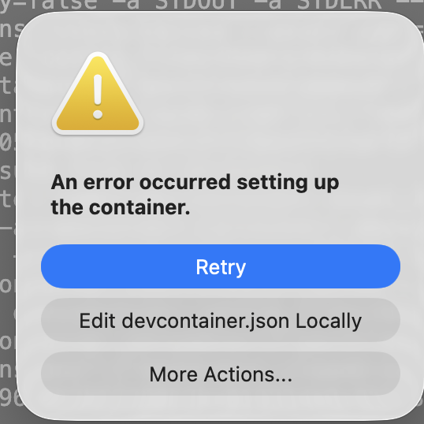
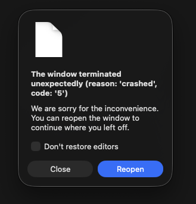
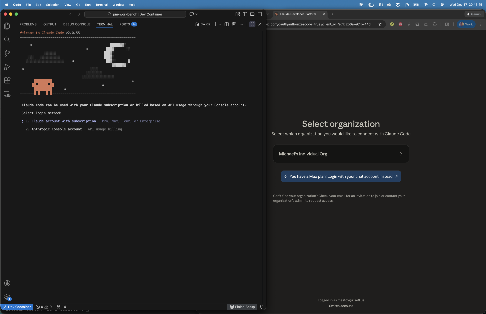

# Troubleshooting Guide

**[← Back to Main README](../README.md)**

This guide covers common issues and their solutions for the AI Assistant Container. For CUI project-specific troubleshooting, see the [CUI Setup Guide](SETUP-CUI.md).

---

## 🔄 First Step: Re-run the Onboarding Script

**Before trying anything else**, re-run the onboarding script:

```bash
./scripts/onboard.sh
```

This script is safe to re-run (idempotent) and will:
- Validate your environment configuration
- Fix common issues automatically (including misconfigured devcontainer.json)
- Update any outdated configuration files

If the script completes successfully and you're still having issues, continue to the specific troubleshooting sections below.

---

## Table of Contents

- [First Step: Re-run the Onboarding Script](#-first-step-re-run-the-onboarding-script)
- [Why Use the Container Instead of Local CLI?](#why-use-the-container-instead-of-local-cli)
- [Onboarding Script Failures](#onboarding-script-failures)
- [Common First-Time Setup Issues](#common-first-time-setup-issues)
- [Authentication to Pull Containers](#authentication-to-pull-containers)
- [VSCode Container Detection Issues](#vscode-container-detection-issues)
- [Podman Networking Issues on macOS](#podman-networking-issues-on-macos-infrastructure-containers)
- [Devcontainer Fails to Open or Rebuild](#devcontainer-fails-to-open-or-rebuild)
- [File Permission Issues in Devcontainer](#file-permission-issues-in-devcontainer)
- [VS Code Window Crashed (Too Many File Handles)](#vs-code-window-crashed-too-many-file-handles)
- [Claude Code Prompts for Login Instead of Using API Key](#claude-code-prompts-for-login-instead-of-using-api-key)
- [Getting Help](#assistance)

---

## Why Use the Container Instead of Local CLI?

**TL;DR:** Running Claude Code locally on your workstation is a security risk. Always use the container.

### The Risk: Supply Chain Attacks via AI CLI Tools

A documented CVE demonstrated that compromised npm packages can detect and exploit locally-installed AI CLI tools (Claude Code, Gemini CLI, etc.) to execute malicious code on developer machines. Because AI CLI tools have broad system access and often run with elevated permissions, they are attractive targets for attackers.

**Attack vector:**
1. Attacker compromises an npm package (or any dependency in your project)
2. Malicious payload detects locally-installed AI CLI tools
3. Payload uses the AI tool's system access to execute attacks (data exfiltration, credential theft, etc.)

### How the Container Protects You

| Risk | Local CLI | Container |
|------|-----------|-----------|
| Access to full filesystem | ✅ Yes | ❌ Only project directory |
| Access to SSH keys, credentials | ✅ Yes | ❌ No |
| Access to browser cookies/sessions | ✅ Yes | ❌ No |
| Can install system packages | ✅ Yes | ❌ No |
| Can modify system configs | ✅ Yes | ❌ No |
| Blast radius if compromised | 🔴 Entire machine | 🟢 Project directory only |

### Container Security Features

The AI Assistant Container provides defense-in-depth:

1. **Isolated filesystem** - Only your project directory is mounted
2. **Minimal toolset** - Reduced attack surface compared to your full workstation
3. **No network access to internal services** - Cannot reach your corporate VPN, local databases, etc.
4. **Ephemeral environment** - Rebuilding the container resets to a known-good state
5. **CUI containers add firewall** - Deny-by-default network policy blocks all non-whitelisted traffic

### What About `--dangerously-skip-permissions`?

Even when running Claude with `--dangerously-skip-permissions` (which bypasses confirmation prompts), the container limits what Claude can access. On your local machine, this flag gives Claude unrestricted access to everything. In the container, Claude still can't escape the sandbox.

### Recommendation

**Always use the container for AI-assisted development.** If you've been running Claude Code locally:

1. Stop using the local installation
2. Set up the container following the [main README](../README.md)
3. Continue your work inside the container

**Questions?** Ask in **#r-and-d** Slack channel.

---

## Onboarding script failures

**If the onboarding script fails:**

1. **Check the log file** for detailed error information:

   **Option A: View in Terminal** (if you're comfortable with command line)
   ```bash
   cat ./ai-assistant-onboard.log
   ```
   This displays the log file contents in your terminal window.

   **Option B: Open in a Text Editor** (easier for most users)
   - Open Finder
   - Navigate to your project folder (where you cloned the repository)
   - Find the file named `ai-assistant-onboard.log`
   - Double-click to open it in TextEdit or your preferred text editor
   - Or right-click → Open With → TextEdit

2. **Common issues and solutions:**
   - **Xcode CLI Tools installation dialog** - Click 'Install' when prompted; script will wait for completion automatically
   - **Admin access denied** - Enable admin privileges in Rippling (see Prerequisites)
   - **Podman machine fails** - Check available disk space (requires ~20GB)
   - **GitHub authentication fails** - Verify network connectivity, try manual login: `gh auth login -s read:packages`
   - **Container registry access denied** - Contact administrator to request access to rise8-us/XPai organization

3. **Re-run the script** - Safe to re-run, it will skip already-completed steps:
   ```bash
   ./scripts/onboard.sh
   ```

4. **Need help?** Ask in #r-and-d Slack channel for assistance

## Common First-Time Setup Issues

### Password not accepted or stuck at password prompt

- **Cause:** Hidden input - you can't see what you're typing
- **Solution:** Type your password carefully (even though invisible) and press Enter
- If you make a mistake, press Ctrl+C to cancel and re-run the script

### Script seems stuck with dots appearing

- **Expected behavior:** This is normal during Xcode Command Line Tools installation
- **What to do:**
  1. Look for "Software Update" or "Install Command Line Tools" dialog
  2. Click "Install" if prompted
  3. Wait for completion (may take 10-15 minutes)
  4. Script continues automatically - do not close terminal

### Zscaler certificate errors when pulling containers

**Symptom:**
```
Error: unable to copy from source docker://ghcr.io/...: tls: failed to verify certificate: x509: certificate signed by unknown authority
```

**Cause:** Podman cannot verify SSL/TLS certificates because Zscaler's CA certificates are not configured or are outdated in the Podman machine. This typically happens when:
- Setup was run with Zscaler turned off
- Podman machine was created before Zscaler was started
- Certificates weren't properly synced during setup
- **It was working before but suddenly stopped:** Zscaler certificates were renewed/updated by IT (certificates in Podman VM are now stale)

**Prevention:** Keep Zscaler ON during setup - the script automatically detects and configures certificates.

**Solution - Manual Certificate Configuration:**

> 💡 **Was working before but suddenly stopped?** This usually means your IT department renewed or updated Zscaler certificates. The certificates in your Podman machine are now outdated. Follow the steps below to extract fresh certificates from your macOS keychain and sync them to Podman. You don't need to reinstall anything - just refresh the certificates.

⚠️ **Open a terminal window before proceeding** - All commands below must be run in Terminal (Applications → Utilities → Terminal, or use GitHub Desktop → Right-click repository → "Open in Terminal")

**Step 1: Verify Zscaler is running**
```bash
# Check if Zscaler process is active
ps aux | grep -i "[Z]scaler"
```

If Zscaler is not running, start it before proceeding.

**Step 2: Verify Zscaler certificates are in macOS keychain**
```bash
# List Zscaler certificates
security find-certificate -c "Zscaler" /Library/Keychains/System.keychain
```

You should see output showing Zscaler certificate(s). If not, contact your IT administrator to install Zscaler certificates.

**Step 3: Extract and configure certificates for Podman**
```bash
# Create certificate directory for ghcr.io
mkdir -p ~/.config/containers/certs.d/ghcr.io

# Extract Zscaler certificates from macOS keychain
security find-certificate -c "Zscaler" -a -p /Library/Keychains/System.keychain > ~/.config/containers/certs.d/ghcr.io/ca.crt

# Verify certificate file was created
ls -lh ~/.config/containers/certs.d/ghcr.io/ca.crt
```

**Step 4: Sync certificates to Podman machine**

The certificates need to be inside the Podman VM. The easiest way is to recreate the machine (it will auto-sync certificates during initialization):

```bash
# Stop and remove the existing Podman machine
podman machine stop
podman machine rm

# Recreate Podman machine (certificates will auto-sync from ~/.config/containers/certs.d/)
podman machine init --cpus 6 --memory 16384
podman machine start
```

**Step 5: Verify the fix**

Test pulling a container image:
```bash
# Test connection to GitHub Container Registry
podman pull ghcr.io/rise8-us/xpai/ai-assistant-home:latest
```

If successful, you should see download progress instead of certificate errors.

**Step 6: Authenticate to GitHub Container Registry**

After fixing certificates, you still need GitHub authentication (see [Authentication to pull containers](#authentication-to-pull-containers) section):
```bash
# Authenticate to ghcr.io
gh auth logout
gh auth login -s read:packages
podman logout ghcr.io
gh auth token | podman login ghcr.io -u $(gh api user --jq .login) --password-stdin
```

**Troubleshooting:**

- **Still getting certificate errors after fix:** Verify certificates are in both locations:
  - Host: `~/.config/containers/certs.d/ghcr.io/ca.crt`
  - VM: Run `podman machine ssh "sudo cat /etc/containers/certs.d/ghcr.io/ca.crt"` to verify

- **Certificate file is empty:** Re-run the extraction command in Step 3. Ensure Zscaler is running.

- **Podman machine won't start after recreation:** Check available resources (disk space, memory). Review logs: `podman machine start`

- **Need help?** Contact #r-and-d Slack channel with:
  - Output of `security find-certificate -c "Zscaler" /Library/Keychains/System.keychain`
  - Output of `ls -lh ~/.config/containers/certs.d/ghcr.io/`
  - Full error message from `podman pull` command

### `code` command not found after setup

- **Cause:** Terminal needs to be restarted to load new PATH
- **Solution:**
  1. Close terminal completely (Cmd+Q)
  2. Open GitHub Desktop
  3. Right-click repository → "Open in Terminal"
  4. Try `code .` again

## Authentication to pull containers

If your project team encounters authentication issues with `ghcr.io`, follow these steps on your host machine:

1. Log into GitHub CLI with package read permissions:
   ```bash
   gh auth logout
   gh auth login -s read:packages
   ```

2. Use your GitHub CLI token to authenticate with the container registry:
   ```bash
   podman logout ghcr.io
   gh auth token | podman login ghcr.io -u $(gh api user --jq .login) --password-stdin
   ```

3. Test pulling the image:
  ```bash
  podman pull ghcr.io/rise8-us/xpai/ai-assistant-home@sha:<digest>
  ```

## VSCode container detection issues

If VSCode doesn't automatically detect or prompt to reopen in the container:

1. Verify the [Dev Containers extension](https://marketplace.visualstudio.com/items?itemName=ms-vscode-remote.remote-containers) is installed
2. Check container runtime is configured in VSCode settings:
   
   
3. Manually trigger: Press `Cmd+Shift+P` → "Dev Containers: Reopen in Container"

## Podman networking issues on macOS (infrastructure containers)

**Applies to:** Projects that run infrastructure containers (databases, auth servers, etc.) alongside the AI assistant container using docker-compose or similar orchestration.

**Symptom:** Browser cannot reach services via custom hostnames (e.g., `auth.myproject.localhost`, `db.myproject.localhost`) even though `/etc/hosts` entries exist. Authentication flows hang or timeout.

**Root Cause:** Podman on macOS uses user-mode networking (slirp4netns) which only forwards ports via IPv6 loopback (::1). Standard IPv4-only `/etc/hosts` entries (127.0.0.1) are insufficient for hostname resolution in browsers.

**Solution:** Add both IPv4 and IPv6 loopback entries to `/etc/hosts`:

```bash
# /etc/hosts - Both IPv4 and IPv6 entries required for Podman on macOS
127.0.0.1  myproject.localhost
127.0.0.1  auth.myproject.localhost
127.0.0.1  db.myproject.localhost

# IPv6 entries (REQUIRED for Podman on macOS with user-mode networking)
::1  myproject.localhost
::1  auth.myproject.localhost
::1  db.myproject.localhost
```

**Recommended Approach:** Create an idempotent script in your project's `infra/` or `scripts/` directory:

```bash
#!/bin/bash
# scripts/update-hosts.sh - Idempotent hosts file configuration

HOSTS_ENTRIES=(
  "127.0.0.1 myproject.localhost"
  "127.0.0.1 auth.myproject.localhost"
  "127.0.0.1 db.myproject.localhost"
  "::1 myproject.localhost"
  "::1 auth.myproject.localhost"
  "::1 db.myproject.localhost"
)

echo "Updating /etc/hosts with required entries..."
for ENTRY in "${HOSTS_ENTRIES[@]}"; do
  if ! grep -qF "$ENTRY" /etc/hosts; then
    echo "Adding: $ENTRY"
    echo "$ENTRY" | sudo tee -a /etc/hosts > /dev/null
  else
    echo "Already exists: $ENTRY"
  fi
done
echo "✅ Hosts file updated successfully"
```

**Usage:**
```bash
chmod +x scripts/update-hosts.sh
./scripts/update-hosts.sh
```

**Note:** Docker Desktop on macOS does not have this limitation as it uses a different networking implementation (vpnkit). This issue is specific to Podman's user-mode networking.

## Devcontainer fails to open or rebuild

**Symptom:**

When attempting to open or rebuild the devcontainer, you see an error dialog:



"An error occurred setting up the container."

**Common Causes:**
1. Missing `.env` file (most common)
2. Configuration errors in `.devcontainer/devcontainer.json`
3. Container image pull failures
4. Podman machine issues

**Solution:**

**Step 1: View detailed error messages**

The error dialog only shows a generic message. To see the actual error details:

1. Click **"Edit devcontainer.json Locally"** or **"More Actions..."**
2. Select **"Reopen Folder Locally"** to exit the container attempt
3. VSCode will automatically open the error log in an editor window on the right side
4. Review the error messages (scroll to the bottom for the most recent errors)
5. Copy the full error output for diagnosis

**Step 2: Check for missing .env file (most common issue)**

The most common cause is a missing `.env` file with your Anthropic API key:

```bash
# Check if .env file exists
ls -la .env

# If missing, copy from example and add your API key
cp .env.example .env

# Edit .env and add your API key
# ANTHROPIC_API_KEY=sk-ant-api03-...
```

After creating/updating `.env`, try reopening the container:
- Press `Cmd + Shift + P`
- Type "Dev Containers: Reopen in Container"

**Step 3: Get AI assistance with error messages**

If the issue isn't the missing `.env` file, use an AI assistant to diagnose:

1. Copy all the error messages from the Dev Containers output
2. Go to [Google Gemini](https://gemini.google.com) or similar AI tool
3. Paste the error messages and ask: "What is causing this devcontainer error and how do I fix it?"

## File permission issues in devcontainer

If you experience file permission problems inside the devcontainer (e.g., unable to create files/folders, files owned by 'root' or 'dialout' instead of 'aiAssistant', "Permission denied" errors), this is typically caused by running podman in rootful mode instead of rootless mode.

**Diagnosis:**

Check if your podman machine is running in rootless mode:
```bash
podman info --format '{{.Host.Security.Rootless}}'
```

This should return `true`. If it returns `false`, you are running in rootful mode.

**Solution:**

Rootless mode is the default for podman. If your machine is running in rootful mode, the recommended approach is to delete the podman machine and recreate it:

```bash
# Stop and delete the current machine
podman machine stop
podman machine rm

# Create and start a new machine (will default to rootless)
podman machine init
podman machine start
```

After recreating the machine, rebuild your devcontainer in VSCode.

**Note:** In some cases, even with rootless mode, files may still be owned by 'root'. If this occurs after recreating your podman machine, you can add the following to your `.devcontainer/devcontainer.json` `runArgs`:

```json
"runArgs": [
  "--userns=keep-id:uid=1001,gid=1001"
]
```

Then rebuild the devcontainer.

## VS Code Window Crashed (Too Many File Handles)

**Symptom:**

VS Code crashes with a dialog showing:



```
The window terminated unexpectedly (reason: 'crashed', code: '5')
```

**Cause:**

VS Code's file watcher is monitoring too many files, exhausting system file handle limits. This commonly happens in projects with large `node_modules` directories, build outputs (`dist/`, `build/`, `.next/`), or other generated files.

**Solution:**

Enable both performance optimizations in `.devcontainer/devcontainer.json`. The template includes commented-out sections for this purpose.

**Step 1: Enable cache volumes** (moves `node_modules` out of watched workspace)

Find the `mounts` section and uncomment it, replacing `YOURPROJECT` with your project name:

```json
"mounts": [
  "source=YOURPROJECT-node-modules,target=/workspaces/${localWorkspaceFolderBasename}/node_modules,type=volume",
  "source=YOURPROJECT-npm-cache,target=/home/aiAssistant/.npm,type=volume"
]
```

**Step 2: Enable file watcher exclusions** (prevents watching remaining large directories)

Find the `settings` block inside `customizations.vscode` and uncomment it:

```json
"settings": {
  "files.watcherExclude": {
    "**/node_modules/**": true,
    "**/.git/objects/**": true,
    "**/.git/subtree-cache/**": true,
    "**/dist/**": true,
    "**/build/**": true,
    "**/.next/**": true,
    "**/.pnpm-store/**": true,
    "**/target/**": true,
    "**/__pycache__/**": true
  },
  "search.exclude": {
    "**/node_modules": true,
    "**/dist": true,
    "**/build": true,
    "**/.next": true,
    "**/target": true
  }
}
```

**Step 3: Rebuild the devcontainer**

- Press `Cmd + Shift + P` (macOS) or `Ctrl + Shift + P` (Windows/Linux)
- Type "Dev Containers: Rebuild Container"
- After rebuild, run `npm install` to populate the volume

**Why both?** Volumes move `node_modules` entirely out of the workspace so VS Code doesn't watch it at all. File watcher exclusions handle any remaining large directories (build outputs, caches) that stay in the workspace.

## Claude Code Prompts for Login Instead of Using API Key

**Symptom:**

When you open a terminal inside the devcontainer and Claude Code starts, instead of being ready to use, it shows a "Welcome to Claude Code" screen with login options:



```
Select login method:
  1. Claude account with subscription - Pro, Max, Team, or Enterprise
  2. Anthropic Console account - API usage billing
```

A browser window may also open asking you to "Select organization" on the Claude Developer Platform.

**Cause:**

Claude Code cannot find your `ANTHROPIC_API_KEY` environment variable. This happens when:
- The `.env` file is missing from your project root
- The `.env` file exists but doesn't contain `ANTHROPIC_API_KEY`
- The `ANTHROPIC_API_KEY` value is empty or malformed
- The `devcontainer.json` is misconfigured (not loading the `.env` file)

**Solution:**

1. **Re-run the onboarding script** (fixes most cases including misconfigured devcontainer.json):
   ```bash
   ./scripts/onboard.sh
   ```
   The script will validate and fix your configuration automatically.

2. **If that doesn't work**, check your `.env` file manually:
   ```bash
   ls -la .env
   ```

3. **If `.env` is missing, create it from the example:**
   ```bash
   cp .env.example .env
   ```

4. **Edit `.env` and add your Anthropic API key:**
   ```bash
   # Open .env in your editor and add:
   ANTHROPIC_API_KEY=sk-ant-api03-your-key-here
   ```

5. **Rebuild the devcontainer** to pick up the new environment variable:
   - Press `Cmd + Shift + P` (macOS) or `Ctrl + Shift + P` (Windows/Linux)
   - Type "Dev Containers: Rebuild Container"
   - Select it and wait for the rebuild to complete

6. **Verify the fix** - After rebuild, open a new terminal. Claude Code should start without prompting for login.

**Note:** To obtain an Anthropic API key, submit a ticket in the **#helpdesk** Slack channel.

## Assistance

If you run into issues, please hit us up in the **#r-and-d** Slack channel.

---

**[← Back to Main README](../README.md)**
